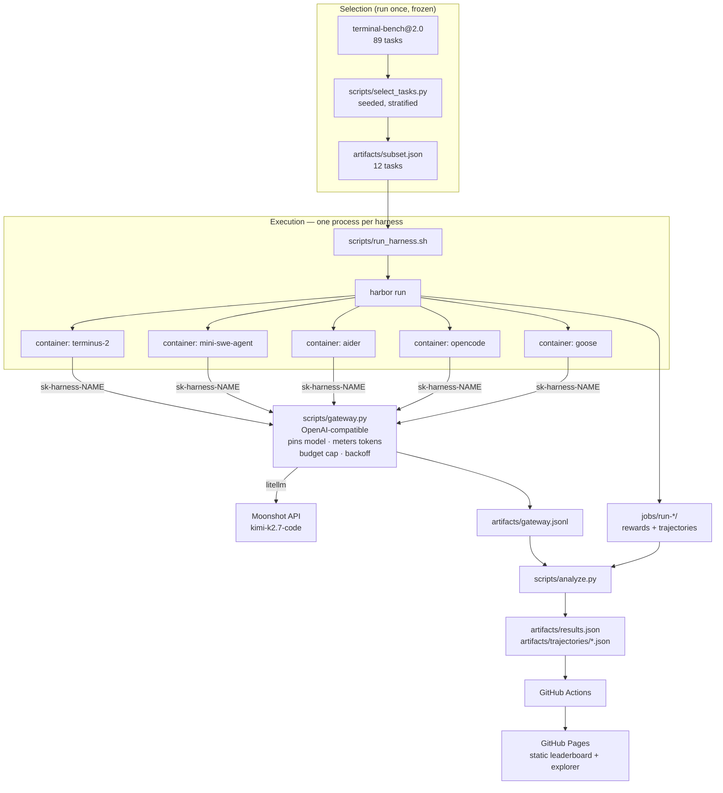

# Architecture — Harbor harness spread

## Overview

This repository runs one controlled experiment and publishes its result as a static site.

The experiment holds a language model fixed and varies only the *agent harness* wrapped
around it, over a frozen subset of Terminal-Bench 2.0, then measures how far apart the
harnesses land. [Harbor](https://github.com/laude-institute/harbor) — the eval framework
from the Laude Institute team behind Terminal-Bench — supplies the benchmark, the container
orchestration, the harness adapters, and the verification.

Three things had to be true for the comparison to mean anything, and each drove a design
decision:

1. **Every harness must run the same model through the same door.** Harbor's harness
   adapters each speak to a different provider surface, and several only support
   `openai`/`anthropic`. So all of them are pointed at one local OpenAI-compatible
   **gateway** that overrides whatever model a harness asks for. A harness cannot
   quietly evaluate a different model, and harnesses that only speak "openai" can drive
   Kimi.
2. **Cost must be measured the same way for everyone.** Harnesses self-report tokens
   inconsistently — some report nothing. The gateway meters every call and attributes it
   to a harness by a per-harness API key, so the cost comparison comes from one instrument.
3. **The task subset must be chosen before the results exist.** Selection is a committed,
   seeded script, run once and frozen, so the subset cannot have been tuned to a result.

## System diagram

## Components

| Component | Responsibility | Tech |
|---|---|---|
| `scripts/select_tasks.py` | Picks the task subset deterministically (seeded, stratified by difficulty, spread across categories) and freezes it to `artifacts/subset.json` | Python 3.13, `tomllib` |
| `scripts/gateway.py` | OpenAI-compatible endpoint every harness shares: pins the model, meters tokens per harness, enforces a hard spend cap, retries rate limits with jittered backoff, bounds concurrency and per-request time | FastAPI + uvicorn + litellm |
| `scripts/gw_ctl.sh` | Starts/stops the gateway by PID file and pins pricing and temperature | bash |
| `scripts/run_harness.sh` | Runs one harness over the frozen subset with identical flags, mounts, and env for every harness | bash + Harbor CLI |
| `scripts/analyze.py` | Joins Harbor rewards with the gateway meter into the site's JSON; trims trajectories into readable excerpts | Python |
| `site/index.html` | Static leaderboard, cost-adjusted ranking, task × harness grid, trajectory drill-down | Vanilla HTML/CSS/JS, no build step, no external requests |
| `.github/workflows/deploy.yml` | Copies committed artifacts into the site and publishes to Pages | GitHub Actions |

## Data flow

1. `harbor download terminal-bench@2.0` fetches 89 task definitions (Dockerfile, tests,
   `task.toml` metadata).
2. `select_tasks.py` filters to tasks with an agent budget ≤ 900s, allocates a difficulty
   quota proportional to that pool, then greedily picks across categories with a seeded
   tie-break. Output frozen to `artifacts/subset.json`.
3. `gw_ctl.sh start` launches the gateway bound to `0.0.0.0:4010`, reachable from the host
   and from every task container at the Docker bridge gateway address.
4. `run_harness.sh <harness>` invokes `harbor run` restricted to the frozen task ids, with
   `--model openai/bench-model` and `OPENAI_BASE_URL` pointed at the gateway. Harbor builds
   a container per task, installs the harness inside it, runs it against the task, then runs
   the task's own verifier to produce a reward.
5. Each harness's LLM traffic arrives at the gateway bearing `sk-harness-<name>`; the
   gateway rewrites the model to the pinned upstream, forwards it via litellm, and appends
   one JSONL record per call with tokens, cached tokens, latency, and cost.
6. `analyze.py` joins per-trial rewards from `jobs/` with per-harness usage from
   `artifacts/gateway.jsonl` into `artifacts/results.json`, and writes trimmed trajectory
   excerpts to `artifacts/trajectories/`.
7. On push, the workflow copies those artifacts into `site/data/` and deploys to Pages. The
   page is static and reads only committed JSON, so it cannot disagree with the artifacts.

## Deployment

GitHub Pages, via GitHub Actions on push to `main` (`actions/configure-pages@v5` with
`enablement: true`, `upload-pages-artifact@v3`, `deploy-pages@v4`). The site is plain
static files with no build step and no external network requests — the JSON it reads is
committed in this repository and copied into the artifact at deploy time. Re-running the
experiment and committing new `artifacts/` is what triggers a content change.

## Tech choices & rationale

**Why Harbor.** The experiment needs many harnesses run identically against a containerised
benchmark. Harbor is the only framework I know of that ships adapters for ~40 agents,
the Terminal-Bench 2.0 registry, container orchestration, and verification behind one CLI.
Reimplementing even two harness adapters faithfully would have been the whole project.

What Harbor did well: `harbor download terminal-bench@2.0` and `harbor run -p ... -a <agent>`
worked as documented; per-trial artifacts (rewards, ATIF trajectories, verifier output) are
well-structured and made the analysis mostly a join; `--mounts`, `--ae`, and
`--install-only` were exactly the escape hatches I needed to adapt to a restricted network.

Where I had to work around it, in this environment:

- **The harness adapters are not uniformly model-agnostic.** Aider's adapter hard-codes
  `openai`/`anthropic`; Goose's maps a provider name and never sets a base URL; OpenCode
  reads `OPENAI_BASE_URL` from the *host* process and bakes it into in-container config.
  The gateway exists largely because of this — presenting one `openai` provider to all of
  them made the model genuinely constant.
- **`swe-agent` is broken on tasks without `/testbed` in Harbor 0.20.0.** The adapter builds
  `$(if [ -d /testbed ]; ... else echo '--env.repo.path=$(pwd)'; fi)` — the inner `$(pwd)` is
  single-quoted, so the literal string `$(pwd)` reaches sweagent and it fails with
  `NoSuchPathError: /app/$(pwd)`. Terminal-Bench tasks use `/app`, so it fails on all of them.
- **Container TLS.** This build environment terminates outbound TLS at an inspecting proxy.
  Task containers do not trust its CA, so every harness's installer failed with a
  self-signed-certificate error until the CA bundle was bind-mounted in and the standard CA
  env vars pointed at it. `astral.sh` is additionally unreachable from inside containers
  here, so the host's `uv` binary is bind-mounted onto the container `PATH`, which makes the
  adapters' "install uv if missing" step a no-op.

**Why a custom gateway rather than LiteLLM Proxy.** LiteLLM Proxy would have covered model
pinning and metering, but not the two things that mattered most here: attributing usage to a
*harness* by key with no per-harness config, and a hard spend cap that fails closed on a
fixed prepaid balance. The gateway is ~250 lines and does exactly those.

**Why vanilla HTML for the site.** The page renders a leaderboard, a table, and a grid from
one JSON file. A framework and build step would add supply chain and CI surface for no gain,
and Pages serves the result as-is.

## Known limitations / tradeoffs

- **Single run per harness on the primary matrix.** A repeat pass was run to sample
  run-to-run variance, but it does not cover every harness × task cell. Where the spread is
  small relative to observed flipping, it should not be read as a ranking.
- **`temperature=1` is forced.** Kimi K2.7 Code rejects any other value, so decoding is
  stochastic for every harness. This raises variance and cannot be turned off.
- **12 tasks is a small sample.** Each resolved task moves a harness's rate by 8.3
  percentage points, so confidence intervals are wide. The subset is stratified rather than
  random-uniform, which helps coverage but not sample size.
- **Harness defaults are part of the treatment.** Step limits, prompt templates, and context
  management differ per harness and were left at their defaults. That is deliberate — those
  choices *are* the harness — but it means the comparison is "harness as shipped", not
  "scaffold shape with all else equal".
- **One model, one provider.** The spread measured here is for Kimi K2.7 Code. A different
  model could reorder the harnesses, and this experiment cannot say whether it would.
- **Cost is list price, not billed price.** Cost is computed from Moonshot's published rates
  applied to gateway-metered tokens, not read from an invoice.
